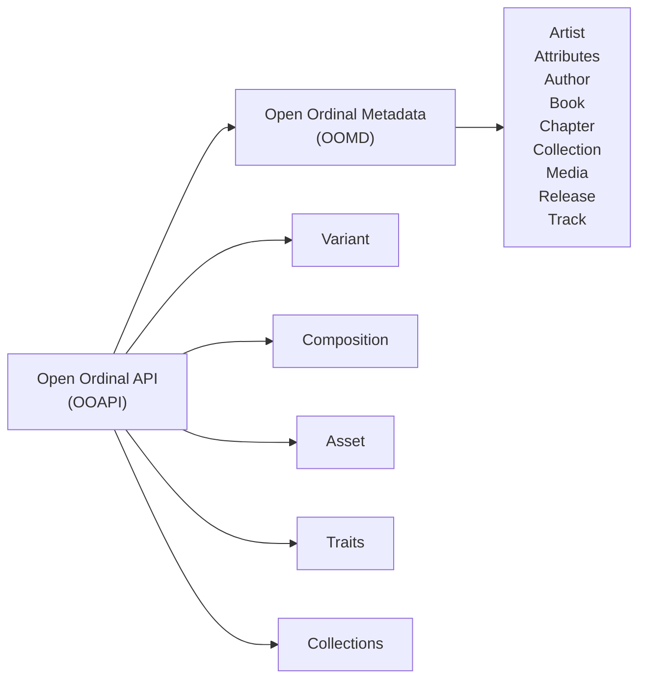

[Open Ordial API](../README.md) / Introduction

> The documentation is still work in progress. Feedback from developers like you will drive the evolution and completeness of the documentation. Your input is invaluable.

# Introduction to the Open Ordinal API

## What is the Open Ordinal API?
The Open Ordinal API is a on-chain flexible JavaScript (TypeScript) API designed to enhance the functionality and interactivity of ordinal-based digital assets inscribed on Bitcoin using the ordinals protocol. It provides a structured way to manage collections, traits, assets, and animations, enabling developers to create dynamic web experiences, which can be used in various applications.

The Open Ordinal API is an on-chain resource, inscribed on sat [156280470160431](https://ordinals.com/sat/156280470160431).

## How and Why to Use the Open Ordinal API
The API allows developers to expose various components of an ordinal, such as individual image assets, making it easier for consumers to fetch and use these assets elsewhere. This flexibility supports a wide range of use cases, from simple single-type ordinals (like .mp3 or .png files) to complex compositions built from multiple assets. By leveraging the Open Ordinal API, developers can transform static ordinal entities into interactive and animated elements, enhancing user engagement and expanding the potential use cases for ordinals. 

## Key Features
- **Organized Asset Management**: Group related assets into collections for easier management
- **Flexibility and Extensibility**: Supports various types of digital content, including images, audio, and video.
- **Ease of Integration**: Designed for seamless integration into existing web applications.
- **Expose and Export**: Make assets, compositions, and variants available to API consumers, enabling them to display or export these elements for use in other applications.

## Developing with the API
To add models and data to the API, you usually follow these steps:

1. **Import the API**: Import the API into your project, the 
2. **Initialize the API**: Ensure the API is available in your project, available on the `window.ooAPI`
3. **Create a model**: Create one or multiple Variant/Asset/Composition/Collection/Trait
4. **Add model to the API**: Add the model to the API, by calling the appropriate function(s).

Each of these steps involves calling specific methods on the `ooAPI` object and passing the necessary parameters to define the assets, compositions, variants, collections, and traits.

## Architecture of the API

## Consuming the API

Consuming the Open Ordinal API involves interacting with the various models and methods provided by the developers. Developers can retrieve existing assets, compositions, variants, collections, and traits using specific API calls. By leveraging methods such as `getAssets()`, developers can access and manipulate these components to create dynamic and engaging applications. This section outlines how to consume the API effectively through practical examples and code snippets.

## Use Cases of the Open Ordinal API
The Open Ordinal API opens up a wide range of possibilities for various applications by allowing them to access and interact with ordinal content. This API goes beyond merely representing ordinals as static entities on the blockchain, enabling dynamic and interactive experiences across different platforms. Here are some key use cases:

- **Launchpads** can allow users to enable the Open Ordinal API on their ordinals. This will allow them to use the API to extend their ordinals with functionality, and gain further utility and reach for their collection(s).

- **Marketplaces** can integrate the API to display detailed information about ordinals, including traits, assets, and animations. It will also allow the marketplaces to improve their caching, by requesting the thumbnail or preview of the ordinal, which can then be served where fit. 

- **Wallets** can leverage the API to display ordinal assets within the user's portfolio, complete with interactive animations and detailed trait information. 

- **Websites** can use the API to embed ordinal content, creating engaging and interactive web pages that showcase the unique attributes and animations of ordinals. It also allows to display different variants of the ordinal, without the predefined visuals, so for example, you can display the character withouth the background

- **Game** developers can integrate the API to use ordinal assets as in-game items, characters, or collectibles, complete with animations and traits that enhance gameplay. Want to add in an audio into the game thats exposed throug the ordinal? No problem.

## Expanding the Usage of Ordinals
By integrating the Open Ordinal API, these platforms can transform ordinals from static blockchain entities into dynamic and interactive digital assets. This not only enhances user engagement but also expands the potential use cases for ordinals, making them more versatile and valuable in various digital ecosystems.
