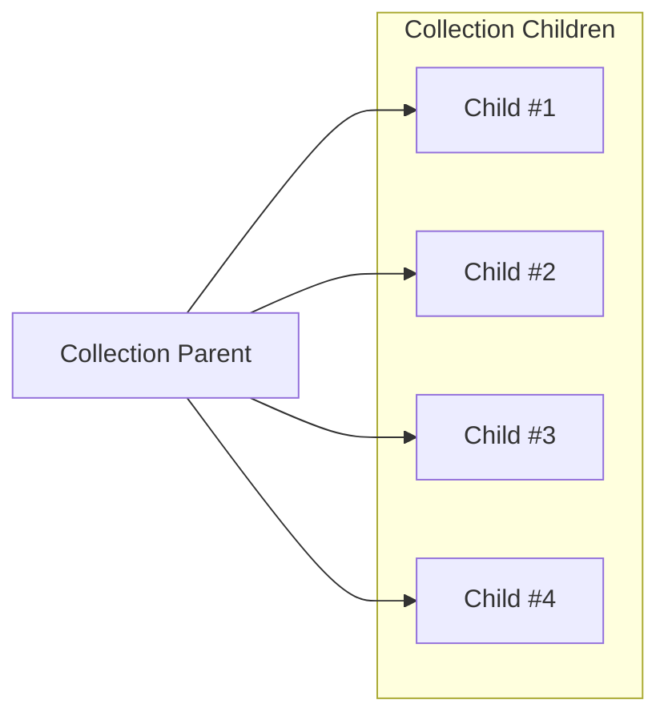
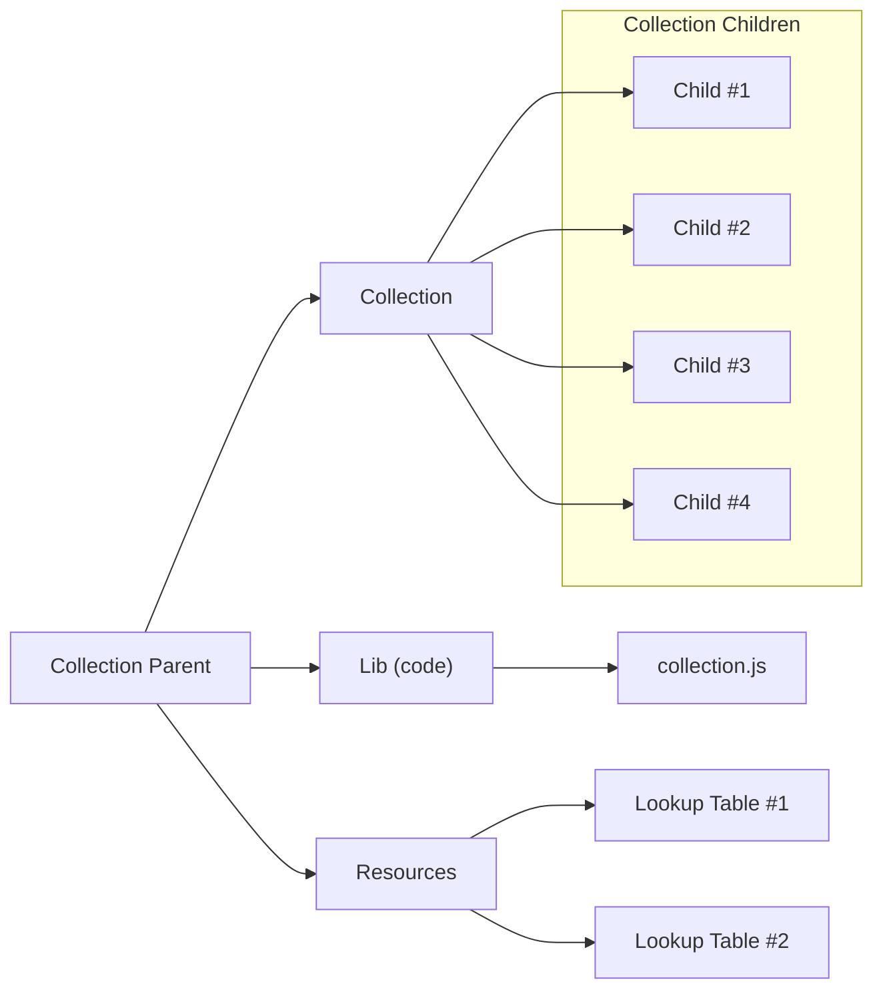

## Structure of Collection
This guide uses the parent-child structure. It's a good way to define a collection and the relationship between the collection and the ordinals that are part of it. 

In this guide, when talking about the ordinals in the collection, we refer to them as "child" or "children" of the parent ordinal.

It is important to note that the structure of a collection is defined by the parent ordinal and the ordinals that are part of it. The best case is to have a parent-child relationship between the ordinals and the parent to make a collection. It's also best to include metadata in the parent ordinal, so it's easier to understand the collection and its content. 

We can add additional data to the parent ordinal by supplying extra information through the Open Ordinal API. In the best case, adding metadata to all the children as well would be beneficial, but it increases the size of the inscription, which increases the cost. Adding information through the Open Ordinal API is a good solution. To further decrease the cost, the collection can have a common JavaScript setup code, so all children reference a common setup code that uses some recipe or instructions to fetch and set up the ordinal, as well as the Open Ordinal API.

## Ordinal Structure
The simplest version of the structure is to define and inscribe a parent ordinal (this can be an image) and then inscribe child in the collection, pointing to the parent.

The parent can be inscribed as an HTML file, embedded with an image to display, and import the Open Ordinal API. Then you can have an image, as well as use the Open Ordinal API to define the collection (and any additional data you want).

### Simple Example
This example shows how you can structure a simple collection with a parent and children.



### Advanced Example
This example shows how you can structure a more advanced collection, where there is a parent that holds multiple categorized children. In this case, the 'Collection' child contains all the collection children (ordinals), the 'Lib(Code)' contains the common code the children reference and use, and the 'Resources' contains any resources the children need, such as lookup tables.



## Parent Example
This example shows how you could structure a parent as a HTML, and include the Open Ordinal API, to define the collection and any additional data you want. You can also embed an image into the parent, to display it, or reference another ordinal as the image.

```html
<!DOCTYPE html>
<html lang="en">
<head>
    <meta charset="UTF-8">
    <meta name="viewport" content="width=device-width, initial-scale=1.0">
    <title>Parent Example</title>
    <script src="/content/{OOAPI_ID}"></script>
</head>
<body>
    <script>
        let ooAPI = window.ooAPI;

        // Define the traits for the collection
        let traits = [
            { name: "Head", traitNames: ["Alien", "Robot"] },
            { name: "Body", traitNames: ["Astronaut", "Police Officer"] },
            { name: "Item", traitNames: ["Bow", "Boxing Gloves"] },
        ];

        // Define the collection
        let collection = new ooAPI.Collection({
            name: "My Collection",
            description: "This is a collection of ordinals",
            collectionTraits: traits,
        });
        // Add collection to the API
        ooAPI.addCollection(collection);

        // Add a variant to the collection
        ooAPI.addVariant({
            type: 'image',
            name: 'default',
            onDisplay: () => {
                let image = document.createElement('img');
                image.id = 'collection_image';
                image.src = '/content/{SOME_CONTENT_ID}'; // or Data URL
                document.body.appendChild(image);
            },
            onHide: () => {
                let image = document.getElementById('collection_image');
                image.remove();
            },
        });

        // The first variants onDisplay will be called when .ready() is called.
        ooAPI.ready();
    </script>
</body>
</html>
```

## TODO Metadata info --json etc

## Next Steps

### [Explore General Concepts](2_General.md) (Part 2)

Dive into the next section to explore general ideas and best practices for creating ordinal collections!

